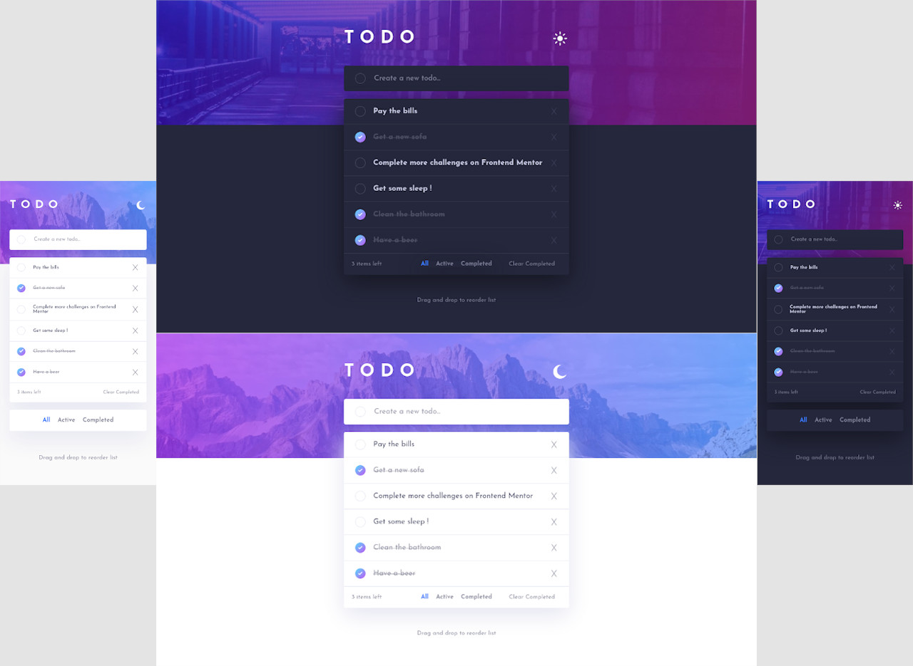

# Frontend Mentor - Todo app solution

This is a solution to the [Todo app challenge on Frontend Mentor](https://www.frontendmentor.io/challenges/todo-app-Su1_KokOW). Frontend Mentor challenges help you improve your coding skills by building realistic projects. 

## Table of contents

- [Overview](#overview)
  - [The challenge](#the-challenge)
  - [Screenshot](#screenshot)
  - [Links](#links)
- [My process](#my-process)
  - [Built with](#built-with)
  - [What I learned](#what-i-learned)
  - [Continued development](#continued-development)
- [Author](#author)

## Overview

### The challenge

Users should be able to:

- View the optimal layout for the app depending on their device's screen size
- See hover states for all interactive elements on the page
- Add new todos to the list
- Mark todos as complete
- Delete todos from the list
- Filter by all/active/complete todos
- Clear all completed todos
- Toggle light and dark mode
- **Bonus**: Drag and drop to reorder items on the list

### Screenshot



### Links

- Live Site URL: [https://vibrant-engelbart-02d5ed.netlify.app/](https://vibrant-engelbart-02d5ed.netlify.app/)

## My process

### Built with

- HTML5 with BEM
- CSS and SASS preproc
- Flexbox
- Mobile-first workflow
- Pure JS except for :
- [Sortable JS](https://sortablejs.github.io/Sortable/) - light JS library to handle items drag and drop

### What I learned

I was willing to have a pure JS code so as to practise as many basics as possible. Though I didn't manage to get a working drag and drop functionnality this way. So I used a little JS framework called Sortable JS, very efficient. Here's how it works :

```js
itemDragAndDrop: itemContainer => {
        Sortable.create(itemContainer, {
            swap: true,
            swapClass: 'ghost',
            animation: 300
        });
    },
```

My itemDragAndDrop function is part of an app object. Here the aim is to target the container of items that must be drag-and-droppable (itemContainer) then we stick a Sortable.create to it with a few options to tweak everything out.

This was also the first time I made a theme functionnality, pretty cool. I chose to have two css files, each one for light and dark theme, and to trigger them with a click event listener in JS. Don't know if this is the best way to make it but it actually works pretty well.

### Continued development

I need to keep working on getting a cleaner, lighter code. Next I will need to get some experience with popular JS frameworks.

## Author

- Frontend Mentor - [@JonathanCazzaro](https://www.frontendmentor.io/profile/JonathanCazzaro)
- Twitter - [@CazzaroJonathan](https://www.twitter.com/CazzaroJonathan)